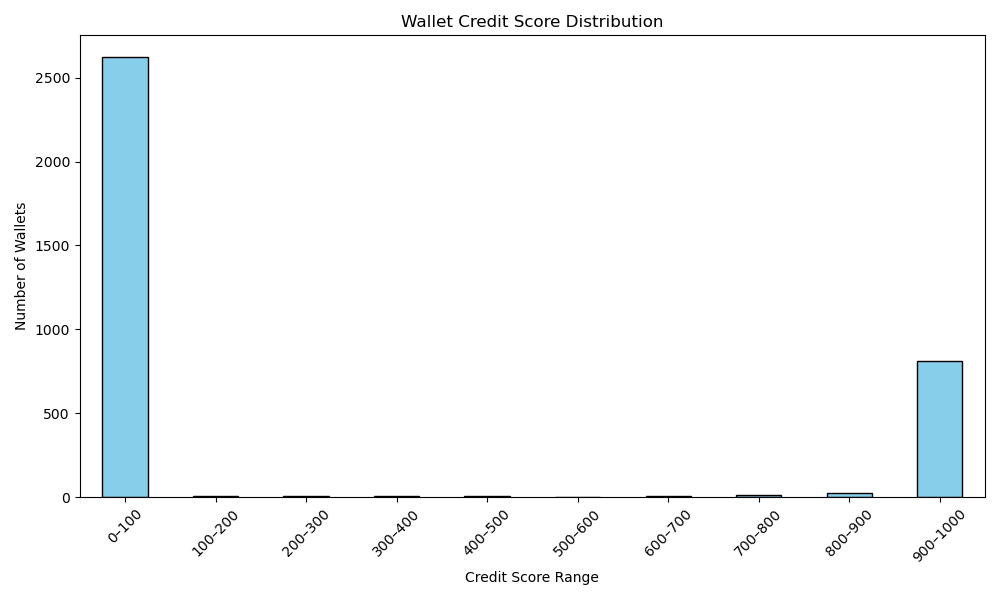

# 📊 Wallet Credit Score Analysis

This file provides an analysis of the wallet credit scores produced for the Aave V2 transaction dataset.

---

## Dataset Summary

- **Source**: ~100,000 raw, transaction-level records from Aave V2
- **Wallets scored**: Number varies based on unique `userWallet`
- **Score range**: 0 to 1000  
- **Purpose**: Higher scores indicate healthy, reliable usage; lower scores highlight risky or exploitative behavior.

---

## Score Distribution

Below is the wallet credit score distribution chart:

### 2 Behavior by Score Range

**🟢 High-score wallets (800–1000)**:

- Typically show regular deposits and timely repayments.

- Have no liquidations.

- Maintain healthy borrow-to-deposit and repayment-to-borrow ratios.

- Behave like genuine retail users or institutional players with sustainable risk profiles.

**🔴 Low-score wallets (0–200):**

- Have one or more liquidation calls.

- Borrow heavily relative to deposits (borrow-to-deposit ratio > 1.5).

- May repay inconsistently (repayment-to-borrow ratio < 0.5).

- May show signs of risky, bot-like strategies or exploit attempts.
